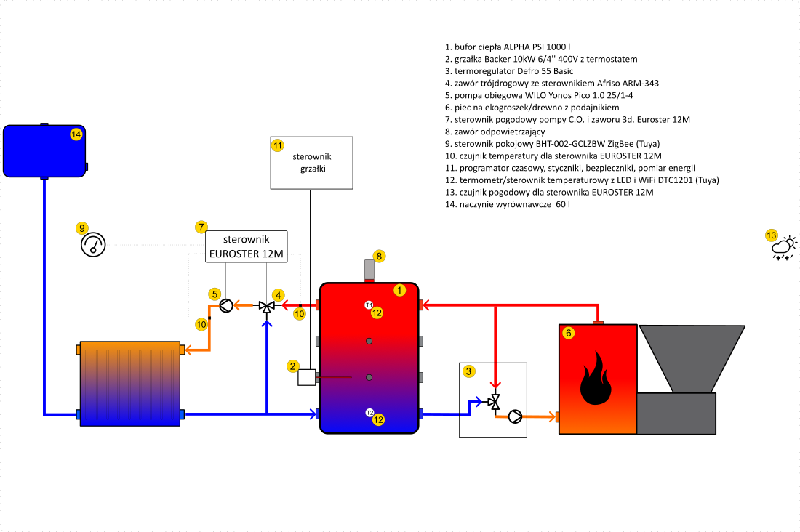

Diagram instalacji składającej się z: 
1. bufor ciepła ALPHA PSI 1000 l
2. grzałka Backer 10kW 6/4'' 400V z termostatem
3. termoregulator Defro 55 Basic
4. zawór trójdrogowy ze sterownikiem Afriso ARM-343 
5. pompa obiegowa WILO Yonos Pico 1.0 25/1-4 
6. piec na ekogroszek/drewno z podajnikiem
7. sterownik pogodowy pompy C.O. i zaworu 3d. Euroster 12M 
8. zawór odpowietrzający
9. sterownik pokojowy BHT-002-GCLZBW ZigBee (Tuya)
10. czujnik temperatury dla sterownika EUROSTER 12M
11. programator czasowy, styczniki, bezpieczniki, pomiar energii
12. termometr/sterownik temperaturowy z LED i WiFi DTC1201 (Tuya)
13. czujnik pogodowy dla sterownika EUROSTER 12M
14. naczynie wyrównawcze 60l

Credits:\
Ikonki termometru, pogody itp:\
https://www.svgrepo.com/svg/70412/snow \
https://www.svgrepo.com/svg/97547/thermometer-high-temperature \
https://symbols.radicasoftware.com/267/pid-pip-valves/20/3-way-valve \
https://symbols.radicasoftware.com/265/pid-iso-equipment/18/pump 
